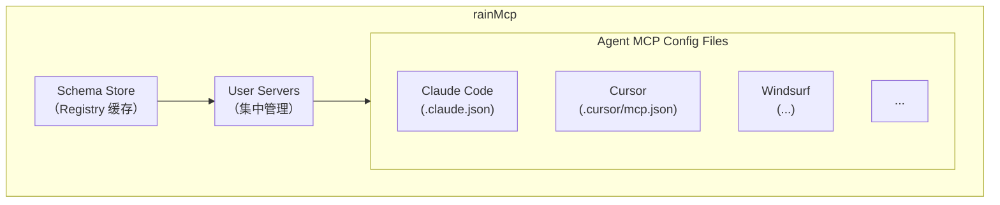
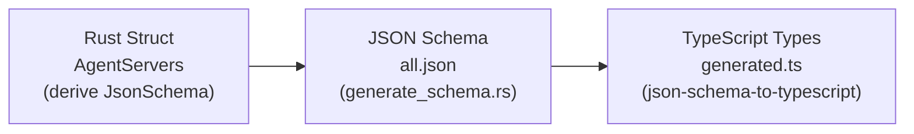

# rainMcp 新人上手文档

## 1. 项目简介

rainMcp 是一个跨平台的 MCP（Model Context Protocol）配置管理器。

### 1.1 解决的问题

目前市面上有多种支持 MCP 的 AI coding agent（如 Claude Code、Cursor、Windsurf、Cline 等），它们各自使用不同的配置文件格式和存储路径。当用户想在多个 agent 之间共享 MCP 服务器配置时，需要手动复制和转换配置，非常繁琐。

### 1.2 核心功能

- 统一管理 10+ 种 AI agent 的 MCP 配置
- 集中管理 MCP 服务器（支持本地和远程两种类型）
- 从官方 MCP Registry 获取服务器 schema
- 一键将服务器配置同步到多个 agent

## 2. 技术栈概览

### 2.1 前端

| 技术            | 版本 | 用途              |
| --------------- | ---- | ----------------- |
| Vue             | 3.x  | UI 框架           |
| TypeScript      | 5.x  | 类型安全          |
| Vite            | 6.x  | 构建工具          |
| Pinia           | 3.x  | 状态管理          |
| Reka UI         | 2.7  | 无头 UI 组件库    |
| UnoCSS          | 66.x | 原子化 CSS        |
| VueUse          | 14.x | 组合式 API 工具集 |
| Lucide Vue Next | -    | 图标库            |

### 2.2 后端

| 技术               | 版本         | 用途             |
| ------------------ | ------------ | ---------------- |
| Tauri              | 2.0          | 跨平台桌面框架   |
| Rust               | 2021 edition | 后端语言         |
| serde / serde_json | -            | JSON 序列化      |
| toml               | -            | TOML 解析        |
| schemars           | -            | JSON Schema 生成 |
| reqwest            | 0.12         | HTTP 客户端      |
| dirs               | 6.0          | 跨平台路径管理   |
| chrono             | -            | 时间处理         |

### 2.3 开发工具

| 工具                      | 用途                                |
| ------------------------- | ----------------------------------- |
| Bun                       | 包管理器和运行时                    |
| Oxlint / oxfmt            | 前端 lint 和 format                 |
| Cargo clippy / rustfmt    | Rust lint 和 format                 |
| json-schema-to-typescript | 从 JSON Schema 生成 TypeScript 类型 |

## 3. 项目结构

```
rainMcp/
├── src/                          # 前端源码
│   ├── api/                      # Tauri 命令封装
│   ├── components/               # Vue 组件
│   │   ├── ui/                   # 基础 UI 组件
│   │   ├── layout/               # 布局组件
│   │   ├── agents/               # Agent 相关组件
│   │   ├── mcp/                  # MCP 相关组件
│   │   └── servers/              # Server 相关组件
│   ├── stores/                   # Pinia 状态管理
│   ├── views/                    # 页面视图（按功能模块分组）
│   │   ├── overview/             # 主仪表板视图
│   │   ├── agents/               # Agents 相关视图
│   │   ├── servers/              # Servers 相关视图
│   │   └── settings/             # Settings 相关视图
│   ├── types/                    # TypeScript 类型定义
│   └── styles/                   # 全局样式
├── src-tauri/                    # 后端源码
│   ├── src/
│   │   ├── lib.rs                # 应用入口
│   │   ├── main.rs               # Tauri 启动
│   │   ├── config.rs             # 应用配置
│   │   └── mcp/                  # MCP 核心模块
│   │       ├── mod.rs            # 模块入口和命令处理器
│   │       ├── agent.rs          # Agent 类型定义和路径管理
│   │       ├── agent_config.rs   # Agent 配置文件读写
│   │       ├── server_schema.rs  # Schema 定义
│   │       ├── registry.rs       # Registry API 客户端
│   │       ├── user_server.rs    # 用户服务器类型
│   │       └── tests/            # 单元测试
│   ├── examples/                 # 示例程序
│   └── Cargo.toml                # Rust 依赖配置
├── package.json                  # 前端依赖和脚本
├── vite.config.ts                # Vite 配置
├── uno.config.ts                 # UnoCSS 配置
└── tsconfig.json                 # TypeScript 配置
```

### 3.1 前后端分工

前端负责：

- 用户界面渲染
- 用户交互处理
- 状态管理和视图切换
- 通过 Tauri invoke 调用后端命令

后端负责：

- 文件系统操作（读写配置文件）
- 跨平台路径处理
- 网络请求（MCP Registry API）
- 数据序列化和格式转换

## 4. 后端模块详解

### 4.1 入口模块（lib.rs）

应用入口，负责：

- 初始化 Tauri 应用
- 注册插件（日志、剪贴板、opener）
- 绑定所有 Tauri 命令处理器

```rust
// src-tauri/src/lib.rs
pub fn run() {
    tauri::Builder::default()
        .plugin(tauri_plugin_log::Builder::new()...)
        .plugin(tauri_plugin_opener::init())
        .plugin(tauri_plugin_clipboard_manager::init())
        .invoke_handler(tauri::generate_handler![...])
        .run(tauri::generate_context!())
}
```

### 4.2 日志模块

使用 tauri_plugin_log 实现多目标日志输出：

- LogDir：写入日志文件
- Stdout：输出到终端
- Webview：发送到前端 console

日志文件位置：

- macOS: ~/Library/Logs/com.shellraining.rainMcp/
- Linux: ~/.local/state/com.shellraining.rainMcp/
- Windows: %LOCALAPPDATA%\com.shellraining.rainMcp\logs\

#### 日志级别控制

日志级别按以下优先级确定：

1. 环境变量 `RUST_LOG`：Rust log crate 标准环境变量

   ```bash
   export RUST_LOG=debug
   bun run tauri dev
   ```

2. 环境变量 `LOG_LEVEL`：自定义环境变量（支持：TRACE, DEBUG, INFO, WARN, ERROR, OFF）

   ```bash
   export LOG_LEVEL=debug
   bun run tauri dev
   ```

3. 开发模式检测：如果使用 `bun run tauri dev` 或 `cargo run`（debug 模式），自动使用 `Debug` 级别

4. 默认值：生产模式使用 `Info` 级别

示例：

```bash
# 使用 Debug 级别（显示所有日志，包括 logger.debug()）
export LOG_LEVEL=debug
bun run tauri dev

# 使用 Trace 级别（最详细的日志）
export LOG_LEVEL=trace
bun run tauri dev

# 只显示 Error 级别日志
export LOG_LEVEL=error
bun run tauri dev

# 不设置环境变量时，开发模式自动使用 Debug 级别
bun run tauri dev
```

### 4.3 应用配置模块（config.rs）

管理应用级配置，存储在 `~/.config/rain-mcp/settings.json`：

```rust
pub struct AppConfig {
    pub clients: HashMap<String, ClientConfigItem>,  // Agent 启用状态
    pub user_servers: Vec<UserServer>,               // 用户自定义服务器
}
```

主要函数：

- `load_app_config()`: 加载配置，不存在则返回默认值
- `save_app_config()`: 保存配置到文件

### 4.4 MCP 核心模块（mcp/mod.rs）

定义核心数据结构：

```rust
// Agent 配置文件中的服务器条目，分为本地和远程两种
pub enum AgentServerEntry {
    Local(LocalServerEntry),   // command + args + env
    Remote(RemoteServerEntry), // url + headers
}

// 支持的 Agent 类型
pub enum AgentType {
    ClaudeCode, Cursor, Windsurf, Cline, ClaudeDesktop,
    RooCode, Trae, GeminiCli, Kiro, OpenAiCodex,
}

// Agent 信息
pub struct SupportedAgent {
    pub agent_type: AgentType,
    pub name: String,
    pub config_path: PathBuf,
    pub is_configured: bool,
    pub enabled: bool,
    pub mcp_config: Option<AgentServers>,
}
```

Tauri 命令处理器：

| 命令                            | 功能                         |
| ------------------------------- | ---------------------------- |
| get_supported_agents_command    | 获取所有支持的 agent 列表    |
| get_agent_mcp_config_command    | 读取指定 agent 的 MCP 配置   |
| update_agent_mcp_config_command | 更新指定 agent 的 MCP 配置   |
| get_enabled_agents_command      | 获取已启用的 agent 列表      |
| update_enabled_agents_command   | 更新 agent 启用状态          |
| open_config_file_command        | 用系统默认程序打开配置文件   |
| refresh_schema_store_command    | 从 Registry 刷新 schema 缓存 |
| get_user_servers_command        | 获取用户自定义服务器列表     |
| add_user_server_command         | 添加用户服务器               |
| add_server_to_agent_command     | 将服务器添加到指定 agent     |

### 4.5 Agent 配置模块（mcp/agent_config.rs）

处理不同 agent 的配置文件格式差异：

| Agent        | 格式 | 配置键名                         |
| ------------ | ---- | -------------------------------- |
| 大多数 agent | JSON | mcpServers                       |
| Claude Code  | JSON | mcpServers（顶层可能有其他字段） |
| OpenAI Codex | TOML | mcp_servers                      |

主要函数：

- `read_agent_config()`: 根据 agent 类型选择解析器
- `save_agent_config()`: 根据 agent 类型选择序列化方式
- `add_server_to_agent()`: 将服务器添加到 agent 配置（直接使用 UserServer.config）

### 4.6 Agent 模块（mcp/agent.rs）

定义支持的 Agent 类型和配置文件路径（跨平台）：

```rust
pub fn get_global_config_path(agent: AgentType) -> Result<PathBuf, String> {
    match agent {
        AgentType::ClaudeCode => home.join(".claude.json"),
        AgentType::Cursor => home.join(".cursor/mcp.json"),
        AgentType::Windsurf => home.join(".codeium/windsurf/mcp_config.json"),
        AgentType::Cline => config_dir.join("Code/User/globalStorage/.../cline_mcp_settings.json"),
        AgentType::ClaudeDesktop => config_dir.join("Claude/claude_desktop_config.json"),
        // ...
    }
}
```

### 4.7 Schema 模块（mcp/server_schema.rs）

定义 MCP Registry 官方 schema 的数据结构：

```rust
pub struct ServerSchema {
    pub name: String,           // 服务器名称（reverse-DNS 格式）
    pub description: String,    // 描述
    pub version: String,        // 版本
    pub packages: Vec<Package>, // 本地安装包配置
    pub remotes: Vec<RemoteTransport>, // 远程传输配置
    // ...
}

pub struct SchemaStore {
    pub servers: Vec<ServerSchema>,  // 所有服务器 schema
    pub updated_at: Option<String>,  // 更新时间
}

pub struct UserServer {
    pub id: String,
    pub name: String,
    pub config: AgentServerEntry,    // 服务器配置（复用 AgentServerEntry）
    pub origin: Option<ServerOrigin>, // 来源信息（用于 UI 展示）
    pub created_at: Option<String>,
}

pub struct ServerOrigin {
    pub origin_type: OriginType,     // Registry 或 Custom
    pub schema_name: Option<String>, // Registry schema 名称
    pub package_id: Option<String>,  // Package 标识如 "npm:@jina-ai/mcp-server"
}
```

### 4.8 Registry 模块（mcp/registry.rs）

MCP Registry API 客户端：

- API 地址：https://registry.modelcontextprotocol.io/v0/servers
- 支持分页，自动获取所有页
- 本地缓存：`~/.config/rain-mcp/schema_store.json`

主要函数：

- `fetch_registry_servers()`: 从 API 获取所有服务器（处理分页）
- `save_schema_store()`: 保存到本地缓存
- `load_schema_store()`: 从本地缓存加载
- `refresh_schema_store_impl()`: 刷新缓存（获取 + 保存）

## 5. 前端模块详解

### 5.1 API 层（api/tauri.ts）

封装所有 Tauri invoke 调用，提供类型安全的接口：

```typescript
// Agent 相关
export async function getSupportedAgents(): Promise<SupportedAgent[]>;
export async function updateEnabledAgents(
  enabledAgents: string[],
): Promise<void>;
export async function updateAgentMcpConfig(
  agentName: string,
  config: AgentServers,
): Promise<void>;

// Schema Store 相关
export async function getSchemaStore(): Promise<SchemaStore>;
export async function refreshSchemaStore(): Promise<SchemaStore>;

// User Server 相关
export async function getUserServers(): Promise<UserServer[]>;
export async function addUserServer(server: UserServer): Promise<UserServer>;
export async function addServerToAgent(
  agentName: string,
  serverId: string,
): Promise<void>;
```

### 5.2 状态管理（stores/）

使用 Pinia 进行状态管理，采用 Composition API 风格：

app.ts - 应用导航状态：

```typescript
export const useAppStore = defineStore('app', () => {
  const currentPrimaryMenu = ref<PrimaryMenu>('overview');  // 当前一级菜单
  const expandedMenu = ref<PrimaryMenu | null>(null);       // 展开的菜单
  const selectedDetailId = ref<string | null>(null);        // 选中的二级项

  function clickPrimaryMenu(menu: PrimaryMenu) { ... }
  function clickDetailItem(menu: PrimaryMenu, detailId: string) { ... }
});
```

agents.ts - Agent 状态：

```typescript
export const useAgentsStore = defineStore('agents', () => {
  const agents = ref<SupportedAgent[]>([]);
  const selectedAgentName = ref<string | null>(null);

  async function fetchAgents() { ... }
  async function toggleAgentEnabled(name: string) { ... }
  async function updateMcpConfig(agentName: string, config: AgentServers) { ... }
});
```

servers.ts - Server 状态：管理用户服务器和 schema store

theme.ts - 主题状态：支持 light/dark/system 三种模式

### 5.3 类型定义（types/）

类型来源：

- types/mcp.ts：手写的业务类型和类型别名
- types/generated.ts：从 Rust schema 自动生成的类型

生成流程：

1. Rust 结构体添加 `#[derive(JsonSchema)]`
2. 运行 `bun run generate:schema` 生成 JSON Schema
3. 运行 `bun run generate:types` 生成 TypeScript 类型

### 5.4 组件体系

布局组件（components/layout/）：

- MainLayout.vue：主布局，包含侧边栏和内容区
- Sidebar.vue：侧边栏，包含菜单导航

UI 组件（components/ui/）：
基于 Reka UI 封装的通用组件：Card、Button、Dialog、Input、Select、Switch、Badge、Tooltip 等

业务组件：

- components/agents/：AgentList、AgentItem、AgentIcon
- components/mcp/：AgentDetail、McpServerCard
- components/servers/：AddServerDialog

### 5.5 视图层（views/）

视图文件按功能模块组织到子目录中：

| 视图                 | 路径                                    | 说明             |
| -------------------- | --------------------------------------- | ---------------- |
| OverviewView         | views/overview/OverviewView.vue         | 主仪表板         |
| AgentsOverviewView   | views/agents/AgentsOverviewView.vue     | Agent 列表       |
| ServersOverviewView  | views/servers/ServersOverviewView.vue   | Server 列表      |
| ServerDetailView     | views/servers/ServerDetailView.vue      | Server 详情      |
| SettingsOverviewView | views/settings/SettingsOverviewView.vue | Settings 主页    |
| 其他设置页面         | views/settings/                         | 主题、关于等设置 |

注意：项目使用 Pinia 状态管理实现视图切换，而非 Vue Router。

## 6. 核心概念

### 6.1 Agent 和 MCP Server 的关系



- Schema Store：从 MCP Registry 获取的服务器元数据缓存
- User Servers：用户配置好的服务器实例（填写了环境变量等）
- Agent Config：各 agent 的配置文件，rainMcp 可以将 User Server 同步到这些文件

### 6.2 配置文件格式差异

JSON 格式（大多数 agent）：

```json
{
  "mcpServers": {
    "server-name": {
      "command": "npx",
      "args": ["-y", "@modelcontextprotocol/server-filesystem"],
      "env": { "PATH_TO_WATCH": "/tmp" }
    }
  }
}
```

TOML 格式（OpenAI Codex）：

```toml
[mcp_servers.server-name]
command = "npx"
args = ["-y", "@modelcontextprotocol/server-filesystem"]

[mcp_servers.server-name.env]
PATH_TO_WATCH = "/tmp"
```

### 6.3 Schema 生成流程



步骤：

1. Rust 结构体添加 `#[derive(Serialize, Deserialize, JsonSchema)]`
2. `bun run generate:schema`：运行 examples/generate_schema.rs 生成 JSON Schema
3. `bun run generate:types`：使用 json-schema-to-typescript 生成 TS 类型

## 7. 调试与测试

### 7.1 日志查看

开发时日志输出到：

- 终端（Stdout）
- 浏览器 DevTools Console（Webview）
- 日志文件（见 4.2 节）

使用 `log` crate 的宏：

```rust
use log::{debug, info, error};
info!("Fetching registry servers");
debug!("Page {} response status: {}", page, status);
error!("Failed to parse: {}", e);
```

### 7.2 Rust 单元测试

测试文件位于 `src-tauri/src/mcp/tests/`：

| 文件                    | 测试内容                                |
| ----------------------- | --------------------------------------- |
| fixtures.rs             | 测试工具函数（创建临时目录、mock 环境） |
| get_config_tests.rs     | 配置读取测试                            |
| update_config_tests.rs  | 配置更新测试                            |
| enabled_agents_tests.rs | Agent 启用状态测试                      |
| user_servers_tests.rs   | 用户服务器 CRUD 测试                    |
| schema_store_tests.rs   | Schema Store 测试                       |

运行测试：

```bash
cd src-tauri
cargo test
```

测试使用 rstest 框架，支持参数化测试和 fixtures。

## 8. 代码规范

### 8.1 Lint

前端：

```bash
bun run lint:fe      # Oxlint 检查
bun run lint:rust    # Cargo clippy
bun run lint         # 同时检查前后端
```

后端 clippy 配置（Cargo.toml）：

```toml
[lints.clippy]
all = "warn"
pedantic = "warn"
# 禁用部分过于严格的规则
missing_errors_doc = "allow"
missing_panics_doc = "allow"
```

### 8.2 Format

```bash
bun run format:fe    # oxfmt 格式化前端
bun run format:rust  # rustfmt 格式化后端
bun run format       # 同时格式化前后端
```

### 8.3 类型同步

修改 Rust 数据结构后，需要重新生成 TypeScript 类型：

```bash
bun run generate:schema && bun run generate:types
```
